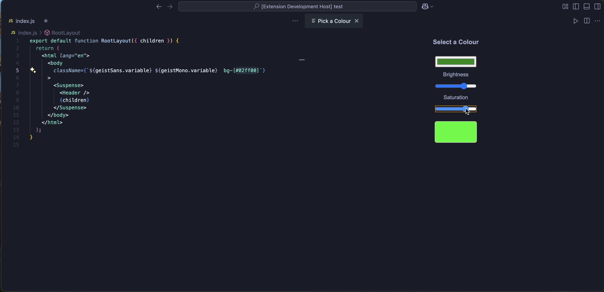

# VSColourWheel

This extension for Visual Studio Code allows you to quickly change Hex colour values.

## Features

The extnesion allows you to modify the Hex value in line in your code.

It will also allow you to chnage the brigthness and saturation of the colour.

Below is an image of the extension being used.

## Requirements

No specific requirements needed

## Extension Setting

None at this moment.

## Known Issues

No issues reported at this moment.

## Release Notes

Users appreciate release notes as you update your extension.

### 1.0.0

Initial release of VSColourWheel
